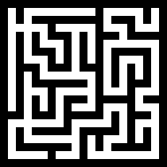
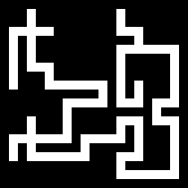
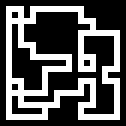

# Procedural Dungeon Crawler

This is a fun little project where I recreate [Jamis Buck's Dungeon Generator](https://www.myth-weavers.com/generate_dungeon.php) in Python

Algorithm: [Random Dungeon Design by Jamis Buck](http://www.brainycode.com/downloads/RandomDungeonGenerator.pdf)

## Maze

Create a maze instance and connect the cells to have a perfect maze

```
width = 10
height = 10
maze = Maze(width, height)
maze.create(randomness=0.6)
```

Make it sparse by removing some deadends (if you remove all deadends you will end up with no connected cells since it's a perfect maze)
```
maze.make_sparse(sparseness_ratio=0.4)
```

Close the remaining deadends to allow loops and have something that ressembles dungeon corridors better

```
maze.close_deadends(randomness=0.6)
```

To have a visual of the maze use `_ascii` or `_draw`

`_ascii` will return a ASCII representation of the maze

`_draw` will draw the maze in a PIL image and either show it or save depending on if you pass a filename or not

Below is the representation of the maze after each of the step above






## Rooms

todo


## Weapons & Consumables

todo
